# Japa Mala - জপ মালা

## 📥 অ্যাপ ডাউনলোড লিংক  
[Download on google play](https://play.google.com/store/apps/details?id=com.mala.digital_joper_mala)

## 📸 আমাদের অ্যাপের কিছু ছবি

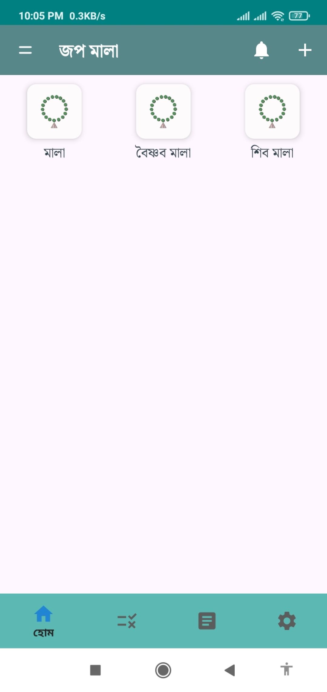
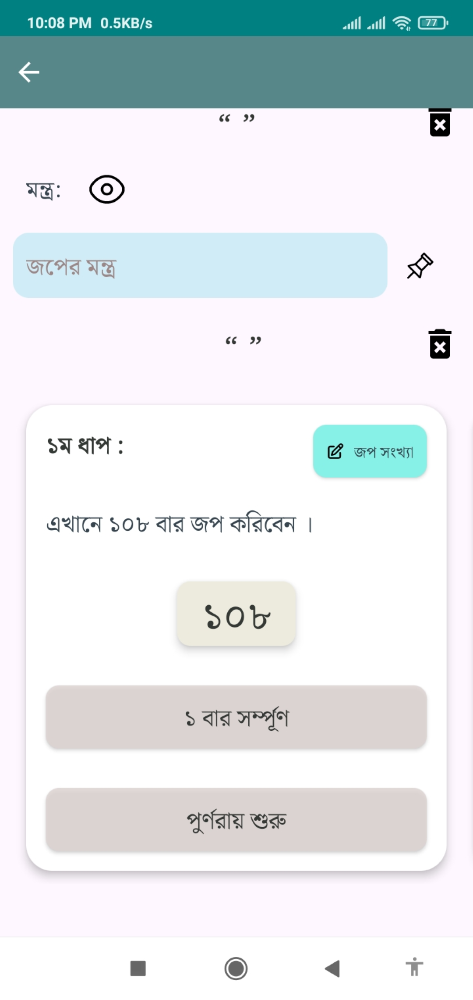
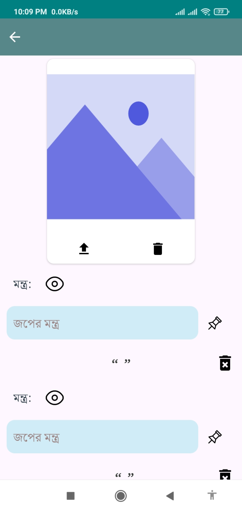
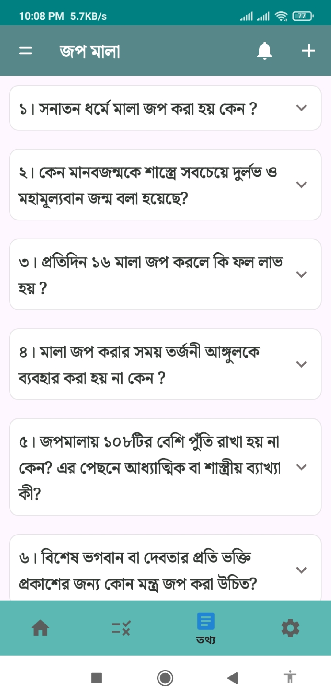
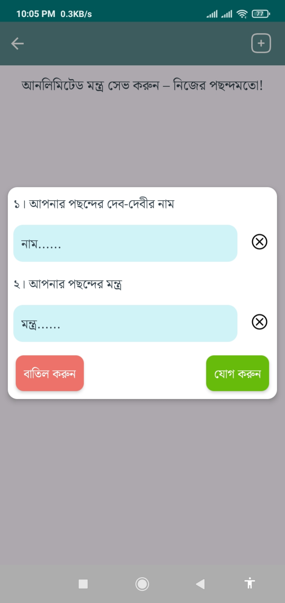
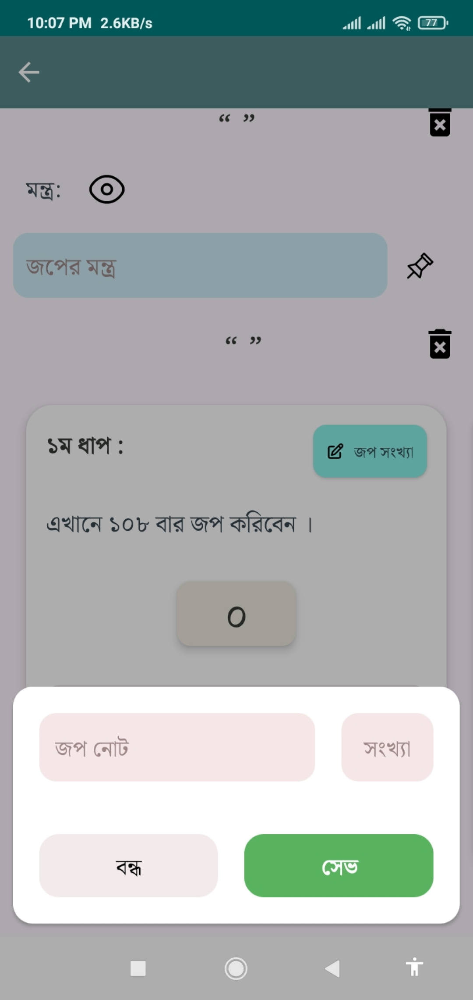
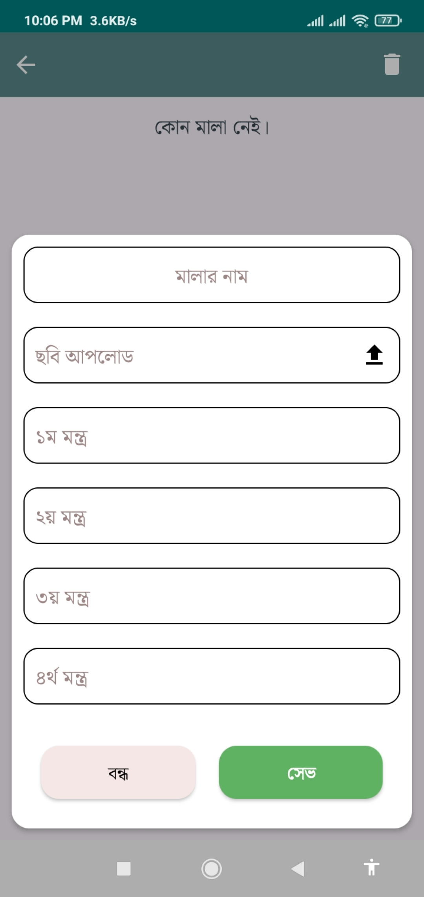
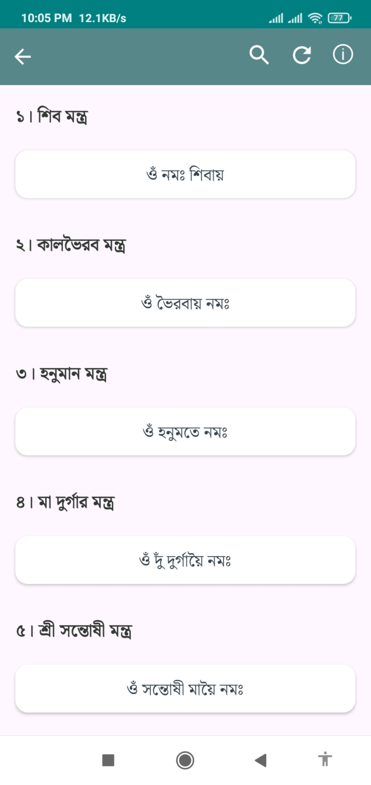
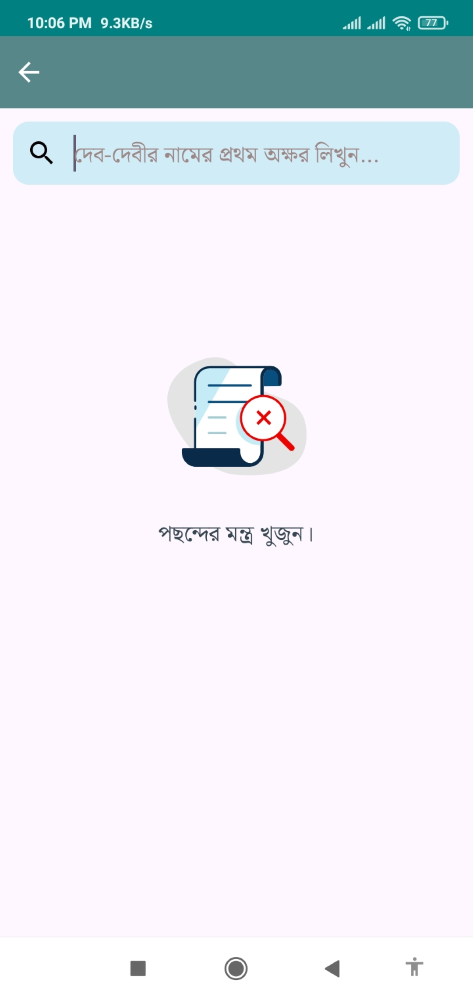
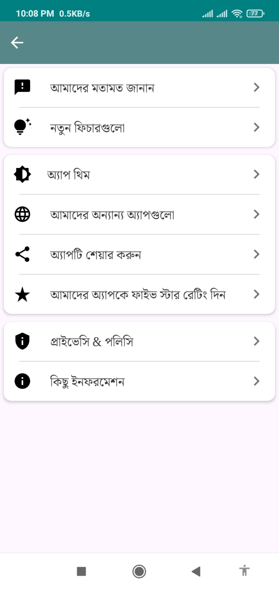

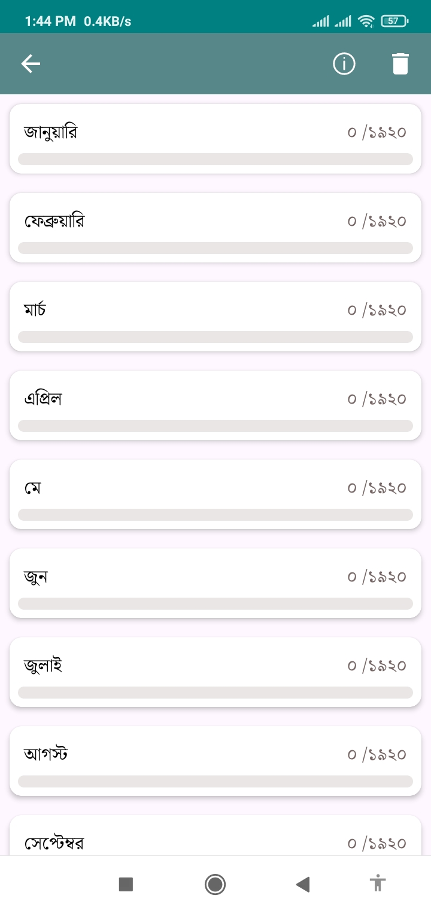

## 🤔 কেন আমাদের অ্যাপ ব্যবহার করবেন?

- সব জপের মন্ত্র এক জায়গায়।

- পছন্দের মন্ত্র সহজে সংরক্ষণ ও ব্যবহার।

- সীমাহীন মন্ত্র সংরক্ষণের সুবিধা।

- জপ ফলপ্রসূ করার সব নিয়ম জেনে জপ করার সুবিধা।

- সুন্দর ও ব্যবহারকারী বান্ধব ডিজাইন।

- জপের ফল সম্পর্কে সহজে জানুন।

## ✨ প্রধান বৈশিষ্ট্য

- মন্ত্র ভান্ডার

- মন্ত্র সংরক্ষণ

- সম্পূর্ণ বিনামূল্যে

- এড ফ্রী

- নিয়মিত আপডেট

- শক্তিশালী নিরাপত্তা ব্যবস্থা

## 🛠️ অ্যাপ তৈরিতে ব্যবহৃত টুলস

| টুলস | প্রোগ্রামিং ভাষা |
|-----|-----|
| ফ্রন্টএন্ড | Xml, Java, Kotlin, Jetpack Compose |
| ব্যাকএন্ড | Core php |
| ডাটাবেস | MySQL, SQLite |

### ⚠️ সতর্কতা

  *এই প্রজেক্টের সকল অধিকার সংরক্ষিত। কেউ অনুমতি ছাড়া ব্যবহার বা পরিবর্তন করলে তার বিরুদ্ধে কঠোর ব্যবস্থা গ্রহণ করা হবে। ☣️*
 

### © 2025 Joy Ray

